# Instructions

## Creating a pass

-   Create a directory for your pass with the name \<# pass name #\>.pass.
-   In that directory place the necessary assets.

### Asset content

| File                                      |                  Purpose                  |
| ----------------------------------------- | :---------------------------------------: |
| background.png                            |      Background picture for the map.      |
| footer.png                                |       Picture next to the barcode.        |
| icon.png                                  |    Icon for notifications and letters.    |
| logo.png                                  |  Logo card. Displayed on the upper left.  |
| manifest.json (will get created later on) |      Registry of all included files.      |
| signature (will get created later on)     |             PKCS7 signature.              |
| pass.json (will get created later on)     |  Appearance and information on the map.   |
| strip.png                                 | Picture behind the main card description. |
| thumbnail.png                             |       Additional picture (specify).       |

## Modifying the pass.json

-   Create a pass.json in the .pass directory.
-   Provide the necessary details in the pass.json. [**help**](./pass.json.md#standard-keys)

## Certificates, identifiers and Profiles

1. Log into your [Apple Developer Console](https://developer.apple.com/account/) and select Certificates, Identifiers & Profiles.

    <!-- 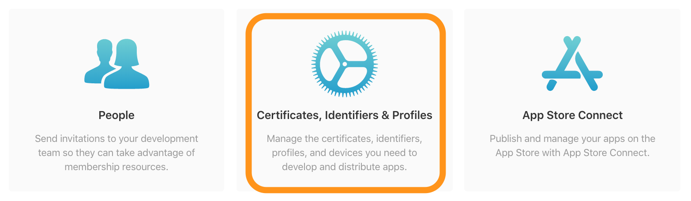 -->

2. Select Identifiers from the menu on the left, and then specify the identifier as Pass Type IDs.

    <!-- 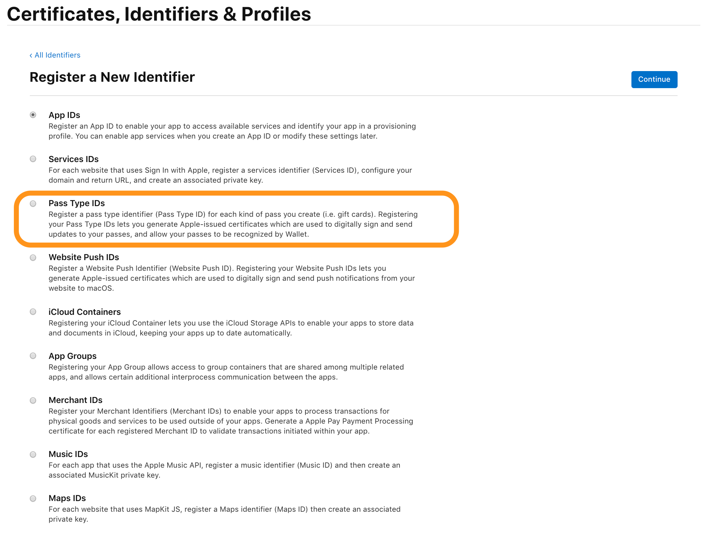 -->

3. Fill in the Pass Type ID Description field and give your ID a unique identifier.

    <!-- 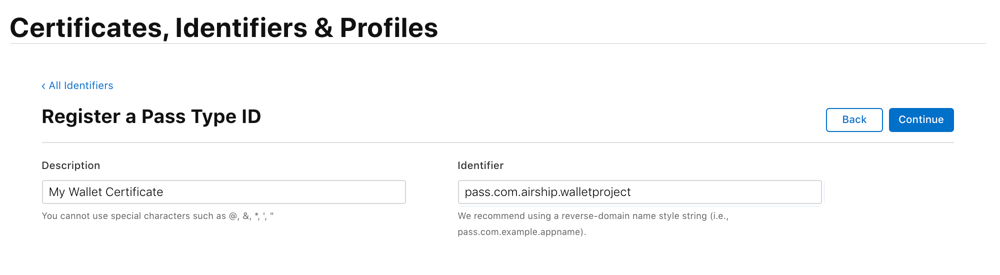 -->

4. Verify your name and identifier then register your Pass Type ID.

    <!-- 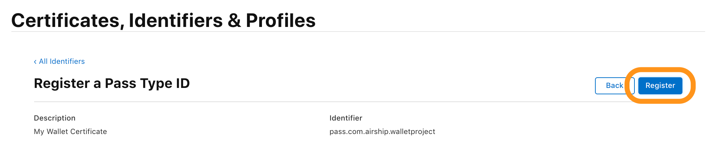 -->

5. Select Select Certificate on your newly made iOS Pass Type ID.

    <!-- 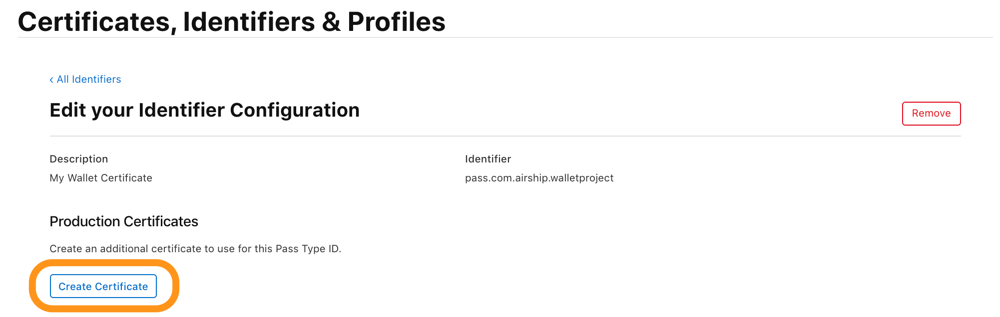 -->

6. Follow the steps outlined in this article: Create a certificate signing request, then upload the Apple Worldwide Developer Relations Certification Authority certificate by selecting Choose File.

    <!-- 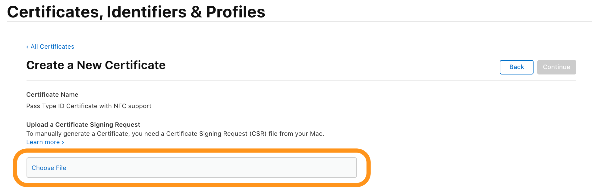 -->

7. Download your new certificate. Double click to add this certificate to your Keychain. Right-click your certificate inside Keychain Access to export to a .p12 file.

    <!-- 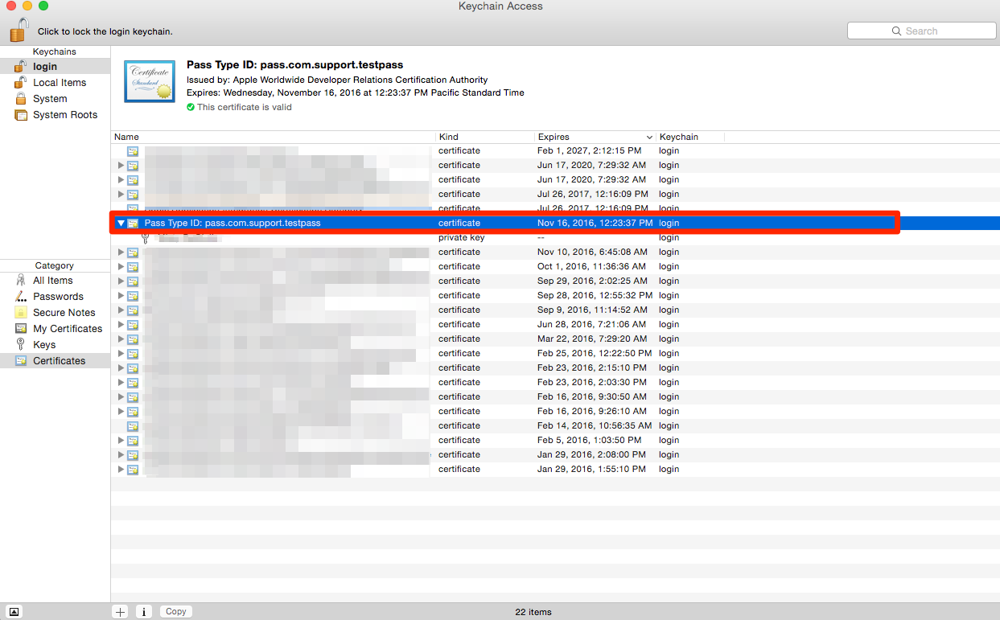 -->

8. Add a password to your certificate. You will need to remember this password when you upload the .p12 file to the Wallet Dashboard.

    <!-- 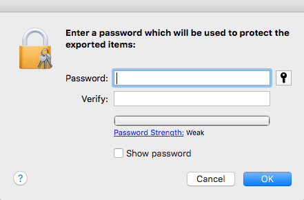 -->

[**Helpful video**](https://www.youtube.com/watch?v=g5KRJgO7yJE)

## Signing the pass

-   Create a manifest.json in the .pass directory.
-   Generate SHA1 hashes for all assets with:

```bash
openssl sha1 <filename>
```

Output should look this

```bash
SHA1(<filename>)= c24766ef5aa92197eace640fcc4fb584a505a733
```

### manifest.json contents

```json
{
    "strip.png": "25b4c9ff2bafe056f3e28379db0ef3fb460c718b",
    "strip@2x.png": "dee775ed6fb3c7278b84c65853401e760caabc92",
    "icon.png": "8eaa0896db93f2165fa417df3d002ce9c61fcd92",
    "icon@2x.png": "555ce7f70f2f44fb7ac9d9f46df5738ec6250f37",
    "logo.png": "e8c4edfbcae41d9d88fad7137d8ed30ae5f73e67",
    "logo@2x.png": "1f9b1cc4c75b380ade07e9f2b7f37f988d9d14c3",
    "pass.json": "c24766ef5aa92197eace640fcc4fb584a505a733"
}
```

-   Export the pass certificate as a PEM file and save it as "passcertificate.pem" inside the same folder. (OpenSSL will spit out the message “MAC verified OK” if the operation is successful.).

```bash
openssl pkcs12 -in Certificates.p12 -clcerts -nokeys -out passcertificate.pem -passin pass:<import password>
```

-   Create a PEM phrase.

```bash
MAC verified OK
Enter PEM pass phrase:
```

-   Next, export the key as a separate file with this command:

```bash
openssl pkcs12 -in Certificates.p12 -nocerts -out passkey.pem -passin pass:<PEM phrase> -passout pass:<key password>
```

-   Now export your Apple Worldwide Developer Relations Certification Authority in to the .pass directory as a .pem file.

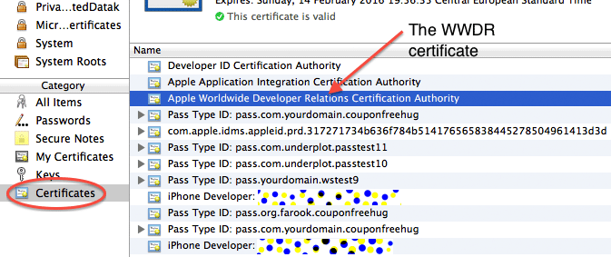

<br />

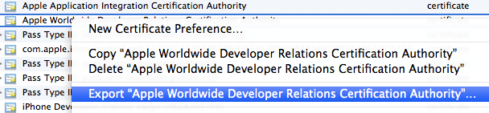

<br />

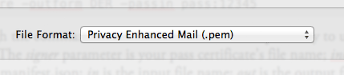

<br />

-   You’re ready to create the signature. Enter this command:

```bash
openssl smime -binary -sign -certfile WWDR.pem -signer passcertificate.pem -inkey passkey.pem -in manifest.json -out signature -outform DER -passin pass:<key password>
```

-   The last remaining step is to combine the various files for the pass into a .pkpass file. Enter this command in the Terminal:

```bash
zip -r <pass name>.pkpass manifest.json pass.json signature logo.png logo@2x.png icon.png icon@2x.png strip.png strip@2x.png
```

Enjoy 🍻
